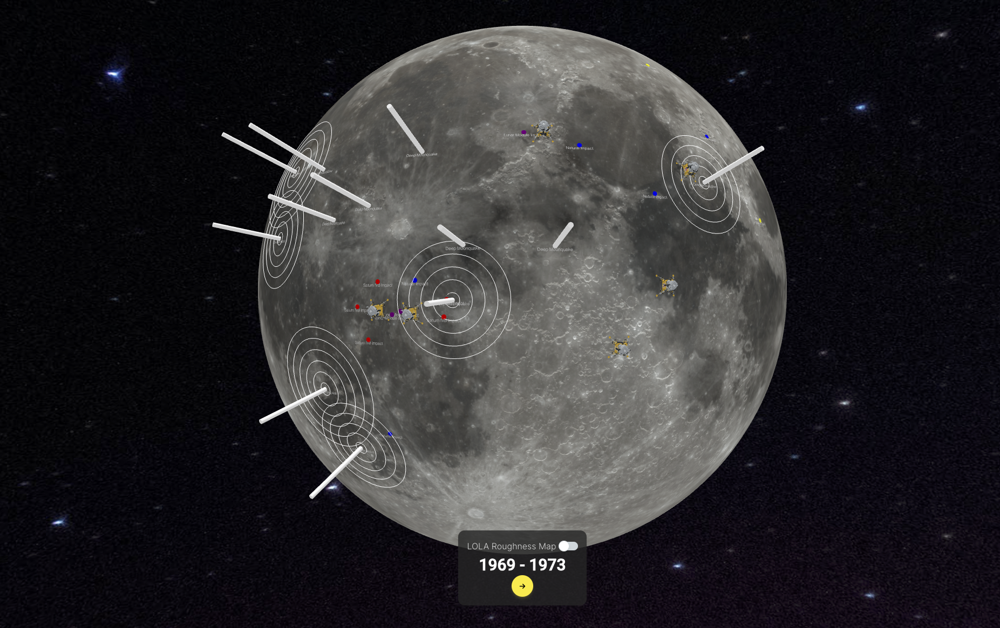

<p align="center">
  <a href="https://moon-globe.vercel.app/">
    
    <h3 align="center">moonGlobe</h3>
  </a>
</p>

<p align="center">3D Animated Moon ploting NASA historical data on moonquakes from 1969 - 1977.</p>

<br/>

## Introduction

This project was created in 1.5 days for the NASA Space Apps Hackathon 2023, Seattle division. We were proud to win the regional `Best Technology` award for this project. Check out the deployed version [here](https://moon-globe.vercel.app/). 

<p align="center">

</p>

## How It Works

This project is built on a Python/Flask API under a Next.JS frontend. The Flask server is hosted as a Python serverless function on Vercel. We used [Globe.GL](https://globe.gl/) for the 3D visualization. 

We mapped historical Seismic Event Catalog data from NASA's [Lognonne 2003 event catalog](https://pds-geosciences.wustl.edu/lunar/urn-nasa-pds-apollo_seismic_event_catalog/data/). The moon and background imagery is also from NASA's photo catalogs. 

## Collaborators

The project would not have been possible without the hard work of our team:

- [Riberiko Niyomwungere](https://github.com/Riberiko)
- [Vladimir Andral](https://github.com/VladAndral)
- [Zane Schaffer](https://github.com/znschaffer)
- [Xinrui Chen](https://github.com/xynree)
- Sebastian Rios

## Viewing Locally


```bash
pnpm install
pnpm dev
```


Open [http://localhost:3000](http://localhost:3000) with your browser to see the result.

The Flask server will be running on [http://127.0.0.1:5328](http://127.0.0.1:5328).